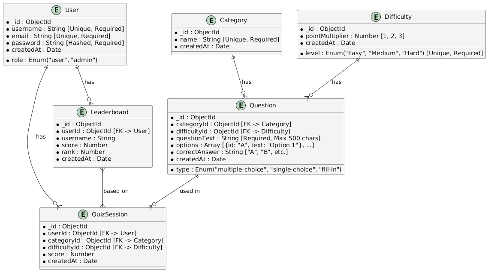

# QuizMaster - A Dynamic Quiz Application 🎯

## 📌 Overview

QuizMaster is a web-based quiz application that allows users to test their knowledge in various categories and
difficulty levels. It provides a smooth quiz-taking experience with a built-in timer, scoring system, and an intuitive
user interface.

The application features an **Admin Panel** for managing quiz questions, categories, and difficulty levels. Security
measures such as session-based authentication, CAPTCHA, and rate limiting ensure a safe and fair user experience.

## 🚀 Features

✔ User Registration & Authentication (Session-based)  
✔ Quiz Selection by Category & Difficulty  
✔ Timed Multiple-Choice and Fill-in-the-Blank Questions  
✔ Score Calculation Based on Difficulty Level  
✔ Admin Panel for Managing Questions & Categories  
✔ Secure System with Rate Limiting & CAPTCHA

## 🔧 Tech Stack

- **Backend:** Node.js, Express.js
- **Frontend:** EJS, TailwindCSS
- **Database:** MongoDB (Atlas)
- **Security:** Express-Session, Rate Limiting, CAPTCHA
- **Deployment:** Render.com

## 🎯 Future Enhancements

✔ Leaderboard for High Scores  
✔ Social Sharing Features  
✔ Multiplayer Quiz Mode

## ⚙️ Setup

1. Install NodeJS
2. Install dependencies
    ```bash
    npm install
    ```
3. Create `.env` file in the root folder (you can copy from `.env.example` and set it with your vars)
4. Run seeding to fill out DB with a testing data (from Open Trivia) if needed `npm run seeds 100`
   (there will be a default admin user with email: `admin@example.com` and password: `admin@example.com`)
5. Run the application
   ```bash
   npm start
    ```

## 🔖 API (Routes) Design (SSR-based)

<details>
  <summary>Click to expend</summary>

### **User Authentication**

| Method | Endpoint         | Description                   |
|--------|------------------|-------------------------------|
| `GET`  | `/auth/login`    | Show login page               |
| `POST` | `/auth/login`    | Login user & start session    |
| `GET`  | `/auth/register` | Show registration page        |
| `POST` | `/auth/register` | Register a new user           |
| `POST` | `/auth/logout`   | Logout user & destroy session |

### **Quiz Participation**

| Method | Endpoint        | Description                                     |
|--------|-----------------|-------------------------------------------------|
| `GET`  | `/quiz`         | Show quiz selection page (category, difficulty) |
| `POST` | `/quiz/start`   | Start quiz & fetch questions                    |
| `POST` | `/quiz/submit`  | Submit answers & calculate score                |
| `GET`  | `/quiz/history` | Show user's past quiz history                   |

### **Admin Panel - Questions Management**

| Method | Endpoint                      | Description                                        |
|--------|-------------------------------|----------------------------------------------------|
| `GET`  | `/admin/questions`            | Show all questions (with search, sort, pagination) |
| `GET`  | `/admin/questions/new`        | Show form to add a new question                    |
| `POST` | `/admin/questions/create`     | Add a new question                                 |
| `GET`  | `/admin/questions/edit/:id`   | Show form to edit a question                       |
| `POST` | `/admin/questions/update/:id` | Update an existing question                        |
| `POST` | `/admin/questions/delete/:id` | Delete a question                                  |

### **Admin Panel - Categories & Difficulty Levels**

| Method | Endpoint                       | Description                          |
|--------|--------------------------------|--------------------------------------|
| `GET`  | `/admin/categories`            | Show all categories                  |
| `GET`  | `/admin/categories/new`        | Show form to add a category          |
| `POST` | `/admin/categories/create`     | Add a new category                   |
| `GET`  | `/admin/categories/edit/:id`   | Show form to edit a category         |
| `POST` | `/admin/categories/update/:id` | Update category details              |
| `POST` | `/admin/categories/delete/:id` | Delete a category                    |
| `GET`  | `/admin/difficulty`            | Show all difficulty levels           |
| `GET`  | `/admin/difficulty/new`        | Show form to add a difficulty level  |
| `POST` | `/admin/difficulty/create`     | Add a new difficulty level           |
| `GET`  | `/admin/difficulty/edit/:id`   | Show form to edit a difficulty level |
| `POST` | `/admin/difficulty/update/:id` | Update difficulty details            |
| `POST` | `/admin/difficulty/delete/:id` | Delete a difficulty level            |

### **Security & Performance**

TBD

| Method | Endpoint                     | Description                              |
|--------|------------------------------|------------------------------------------|
| `GET`  | `/security/captcha`          | Get CAPTCHA challenge before quiz starts |
| `POST` | `/security/validate-captcha` | Validate CAPTCHA response                |
| `GET`  | `/security/rate-limit`       | View rate-limiting status (admin only)   |

### **Future Features (Leaderboard & Social)**

TBD

| Method | Endpoint       | Description                      |
|--------|----------------|----------------------------------|
| `GET`  | `/leaderboard` | Show top quiz scores             |
| `POST` | `/share/score` | Share quiz score on social media |

</details>

## Data Models

### Schema



### Core Entities

<details>
  <summary>Click to expend</summary>

1. **User** Model
    1. Schema:

        ```jsx
        User {
          _id: ObjectId,
          username: String,  // Unique, min 3, max 30 chars
          email: String,  // Unique, valid email
          password: String,  // Hashed, min 8 chars
          role: String,  // "user" or "admin"
          createdAt: Date
        }
        ```

    2. Indexes:
        - `{ "email": 1 }`  - unique
        - `{ "username": 1 }`  - unique
    3. Validation rules:
        - `username`: Min 3, max 30 chars, unique
        - `email`: Valid format, unique
        - `password`: Min 8 chars, hashed before storing
2. **Question** Model
    1. Schema:

        ```jsx
        Question {
          _id: ObjectId,
          userId: ObjectId (Reference to User),  // Required   
          categoryId: ObjectId (Reference to Category),  // Required
          difficultyId: ObjectId (Reference to Difficulty),  // Required
          questionText: String,  // Required, max 1000 chars
          options: [
            { id: "A", text: "Option 1" },
            { id: "B", text: "Option 2" },
            { id: "C", text: "Option 3" },
            { id: "D", text: "Option 4" }
          ],  // At least 2 options, max 6
          correctAnswer: "A",  // Must match one of `options.id`
          type: "multiple-choice",  // Enum: ['multiple-choice', 'single-choice', 'fill-in']
          createdAt: Date
        }
        ```

    2. Indexes:
        - `{ "categoryId": 1, "difficultyId": 1 }`  - filtering
        - `{ "createdAt": -1 }`  - sorting by newest questions
    3. Validation rules:
        - `questionText`: Required, max 500 chars
        - `options`: Min 2, max 6
        - `correctAnswer`: Must be one of `options.id`
        - `type`: Enum: `["multiple-choice", "single-choice", "fill-in"]`
3. **QuizSession** Model
    1. Schema:

        ```jsx
        QuizSession {
          _id: ObjectId,
          userId: ObjectId (Reference to User),  // Required
          categoryId: ObjectId (Reference to Category),  // Required
          difficultyId: ObjectId (Reference to Difficulty),  // Required
          score: Number,  // Calculated after submission
          createdAt: Date
        }
        ```

    2. Indexes:
        - `{ "userId": 1, "createdAt": -1 }` - fast user history lookup
        - `{ "categoryId": 1 }`  - filtering by category
        - `{ "difficultyId": 1 }` - filtering by difficulty
    3. Validation rules:
        - `userId`: Required, must exist in User model
        - `categoryId`: Required, must exist in Category model
        - `difficultyId`: Required, must exist in Difficulty model
        - `score`: Must be a positive number
4. **Category** Model
    1. Schema:

        ```jsx
        Category {
          _id: ObjectId,
          name: String,  // Unique, required
          createdAt: Date
        }
        ```

    2. Indexes:
        - `{ "name": 1 }` - unique, fast lookup
    3. Validation rules:
        - `name`: Required, unique
5. **Difficulty** Model
    1. Schema:

        ```jsx
        Difficulty {
          _id: ObjectId,
          level: String,  // Enum: ["Easy", "Medium", "Hard"]
          pointMultiplier: Number,  // 1 (Easy), 2 (Medium), 3 (Hard)
          createdAt: Date
        }
        ```

    2. Indexes:
        - `{ "level": 1 }` - unique
    3. Validation rules:
        - `level`: Enum: `["Easy", "Medium", "Hard"]`, unique
        - `pointMultiplier`: 1, 2, or 3
6. **Leaderboard** Model
    1. Schema:

        ```jsx
        Leaderboard {
          _id: ObjectId,
          userId: ObjectId (Reference to User),  // Required
          username: String,  // Cached for fast lookup
          score: Number,  // Required
          rank: Number,  // Calculated dynamically
          createdAt: Date
        }
        ```

    2. Indexes:
        - `{ "score": -1 }`  - fetching top scores fast
        - `{ "userId": 1 }` - searching a user's leaderboard position
    3. Validation rules:
        - `userId`: Required, must exist in `User` model
        - `score`: Must be a positive number
        - `rank`: Auto-calculated

</details>

## 🚀 User Stories

<details>
  <summary>Click to expend</summary>

### User Registration & Authentication

| ID    | Feature                | Priority     | Done (✅) |
|-------|------------------------|--------------|----------|
| US-01 | Register an account    | 🔴 MUST HAVE | ✅        |
| US-02 | Login to the system    | 🔴 MUST HAVE | ✅        |
| US-03 | Logout from the system | 🔴 MUST HAVE | ✅        |

### Quiz Participation

| ID    | Feature                              | Priority       | Done (✅) |
|-------|--------------------------------------|----------------|----------|
| US-04 | Select quiz category & difficulty    | 🔴 MUST HAVE   | ✅        |
| US-05 | Answer questions with a timer        | 🔴 MUST HAVE   | ✅        |
| US-06 | See final score after quiz           | 🔴 MUST HAVE   | ✅        |
| US-07 | See correct answers after submission | 🟠 SHOULD HAVE | ❌        |
| US-08 | View past quiz history               | 🟠 SHOULD HAVE | ❌        |

### Quiz Management (Admin)

| ID    | Feature                               | Priority       | Done (✅) |
|-------|---------------------------------------|----------------|----------|
| US-09 | Add new questions                     | 🔴 MUST HAVE   | ✅        |
| US-10 | Update existing questions             | 🔴 MUST HAVE   | ✅        |
| US-11 | Delete unwanted questions             | 🔴 MUST HAVE   | ✅        |
| US-12 | Search, filter & sort questions       | 🟠 SHOULD HAVE | ❌        |
| US-13 | Manage categories & difficulty levels | 🟠 SHOULD HAVE | ✅        |
| US-14 | Manage user roles                     | 🟡 COULD HAVE  | ❌        |

### Leaderboards & Social Sharing (Future Features)

| ID    | Feature           | Priority               | Done (✅) |
|-------|-------------------|------------------------|----------|
| US-15 | View leaderboard  | 🚫 WON’T HAVE (Future) | ❌        |
| US-16 | Share quiz scores | 🚫 WON’T HAVE (Future) | ❌        |

### Security & Performance

| ID    | Feature                                 | Priority       | Done (✅) |
|-------|-----------------------------------------|----------------|----------|
| US-17 | Limit login attempts                    | 🔴 MUST HAVE   | ❌        |
| US-18 | Implement CAPTCHA                       | 🟠 SHOULD HAVE | ❌        |
| US-19 | Optimize performance (caching, indexes) | 🟠 SHOULD HAVE | ❌        |

</details>
